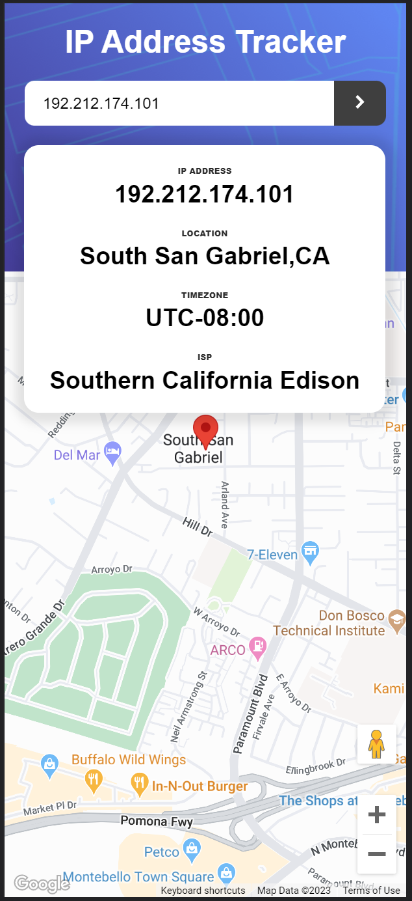

# Frontend Mentor - IP address tracker solution

This is a solution to the [IP address tracker challenge on Frontend Mentor](https://www.frontendmentor.io/challenges/ip-address-tracker-I8-0yYAH0). Frontend Mentor challenges help you improve your coding skills by building realistic projects. 

## Table of contents

- [Overview](#overview)
  - [The challenge](#the-challenge)
  - [Screenshot](#screenshot)
  - [Links](#links)
- [My process](#my-process)
  - [Built with](#built-with)
  - [What I learned](#what-i-learned)
  - [Continued development](#continued-development)
  - [Useful resources](#useful-resources)
- [Author](#author)
- [Acknowledgments](#acknowledgments)

## Overview

### The challenge

Users should be able to:

- View the optimal layout for each page depending on their device's screen size
- See hover states for all interactive elements on the page
- See their own IP address on the map on the initial page load
- Search for any IP addresses or domains and see the key information and location

### Screenshot




### Links

- Solution URL: [Solution](https://your-solution-url.com)
- Live Site URL: [Live Site](https://urealaden.github.io/ip-tracker/)

## My process

### Built with

- Flexbox
- CSS Grid
- Mobile-first workflow
- [React](https://reactjs.org/) - JS library
- [Google Maps JavaScript API](https://developers.google.com/maps/documentation/javascript/)
- [React Google Maps API](https://www.npmjs.com/package/@react-google-maps/api)
- [Ipify API](https://www.ipify.org/)
- [Fluent UI React](https://styled-components.com/) - For styles


### What I learned

This was a fun project to be honest. I initially set out to use the Leaflet API, however there were some issues loading the Tile Layers. I then opted to using the Google Maps API which turned out to be a much better choice as I was able to customize my own maps. This will definitely be something to explore in other projects.

```js Including this here for reference. The API is way easier to use now than it was a few years ago.
export const Map = (props: ILocation) => {
  const lat = props.lat;
  const long = props.long;
  const center = {lat:lat,lng:long};
  const {isLoaded} = useJsApiLoader({
    id:'google-map-script',
    googleMapsApiKey:`${process.env.REACT_APP_GOOGLE_API_KEY}`,
  });
  const [map,setMap] = React.useState<google.maps.Map>();

  const onLoad = React.useCallback((map:google.maps.Map) =>{
    map.setZoom(15);
    setMap(map)
  },[])

  const onUnmount = React.useCallback((map:any) => {
    setMap(undefined);
  },[]);

  return isLoaded ? (
    <GoogleMap
        mapContainerStyle={containerStyles}
        center={center}
        zoom={15}
        options={{mapId:`${process.env.REACT_APP_MAP_ID}`}}
        onLoad={onLoad}
        onUnmount={onUnmount}
    > 
    <Marker
        position={center}
        options={{zIndex:2}}
    />    
    </GoogleMap>
  ) : <></>
};
```

### Continued development

For the next mapping projects, I want to explorer GeoJSON and polygons.

### Useful resources

- [React Google Maps Api Style Guide](https://react-google-maps-api-docs.netlify.app/#distancematrixservice) - This was really good documentation implementing the Google Maps API with React.

## Author

- Website - [Leaundrae Mckinney](https://www.linkedin.com/in/leaundrae-mckinney/)
- Frontend Mentor - [@UreaLaden](https://www.frontendmentor.io/profile/yourusername)

